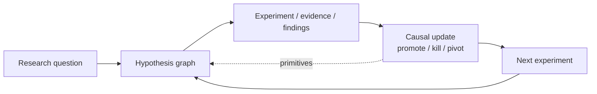

# Atlas

Atlas is a causal reasoning engine for structuring research questions, hypotheses, evidence, and next-step experiments.

It is built for systematic, pre-registered research: you formulate a falsifiable claim, design an experiment against it, record typed evidence, and make an explicit promote / kill / continue / pivot decision. Validated claims are promoted into a causal graph of *reasoning primitives* that later hypotheses can build on. The current application domain is crypto-market microstructure, but the substrate is domain-agnostic.

This is not a generic knowledge store. Edges in the graph are meant to represent *tested* causal claims, not free-text associations.

## At a glance

- Builds and maintains a causal structure of research: hypothesis -> experiment -> evidence -> decision -> primitive.
- Links concrete findings (markdown writeups, backtests, statistical tests) to the hypothesis that motivated them.
- Supports systematic iteration: pre-registered falsification criteria, significance thresholds, and a promotion gate enforced in code.
- Intended for rigorous exploratory workflows where provenance and falsifiability matter — not general note-taking.

## Current implementation

Honest status, based on what is in this repo today:

- **CLI** (`atlas`, entrypoint `src/atlas/cli.py`) with command groups: `hypothesis`, `experiment`, `evidence`, `decision`, `graph`, `cycle`, plus top-level `run` and `scan`. Uses Click.
- **Object model** (`src/atlas/models/`): `Hypothesis`, `Experiment`, `Evidence`, `ResearchCycle`, `ReasoningPrimitive`, `SessionEvent`, `CausalGraph`. Pydantic v2.
- **Storage** (`src/atlas/storage/`): JSON state store under `.atlas/`, append-only JSONL session events under `sessions/`, graph snapshots under `graph/`.
- **Analysis** (`src/atlas/analysis/`): `backtest`, `event_study`, `stationarity`, `statistics`.
- **Data adapters** (`src/atlas/data/`): `market` (ccxt — default exchange Kraken), `derivatives`, `events`, `alternative`, `dune`.
- **Generation** (`src/atlas/generation/`): hypothesis and signal generation helpers, including composite variants.
- **Tests** (`tests/`): backtest, events, promotion gate, signals, state store, stationarity, statistics.
- **Findings** (`findings/`): markdown writeups of individual experiments; the record of what has actually been tested.
- **Scripts** (`scripts/`): standalone research scripts behind several findings (e.g. `zmf_delta.py`, `dispersion_narrow.py`, `events_btc_car.py`).

Intended direction (present as scaffolding, not fully autonomous yet): a continuous signal-intake -> hypothesis-generation -> experiment -> decision loop, as sketched in `CLAUDE.md`. Today the loop is driven by a human operator invoking the CLI and scripts; the pieces are wired, the autonomy is not.

## Repository layout

- `src/atlas/` — Library and CLI. Object model, storage, analysis, data, generation.
- `findings/` — Markdown writeups of individual experiments and their decisions. The durable research log.
- `scripts/` — Standalone Python scripts that produced specific findings.
- `tests/` — Pytest suite covering the core primitives (state store, promotion gate, statistics, backtest, events).
- `sessions/`, `graph/`, `.atlas/` — Runtime state: session event logs, graph snapshots, object store. Created on use.
- `CLAUDE.md` — Operating principles, governance, promotion-gate rules.

## Quickstart

Requires Python 3.11+.

```bash
git clone <this repo>
cd atlas
python -m venv .venv && source .venv/bin/activate
pip install -e .
```

Minimal end-to-end path using the CLI (creates real state under `.atlas/` and `sessions/`):

```bash
# 1. Formulate a hypothesis (opens a research cycle)
atlas hypothesis create \
  --claim "Mean cross-venue funding predicts 24h BTC returns" \
  --rationale "Funding level has shown OOS reversal across specs" \
  --falsification "OOS |t| on z_mf below 1.96 or sign flip"

# 2. Design an experiment against it
atlas experiment design --hypothesis-id <HID> \
  --description "IS/OOS regression on 8h grid" \
  --method statistical_test \
  --success "OOS |t| >= 1.96, sign consistent" \
  --failure "OOS |t| < 1.96 or sign flip"

# 3. Record evidence, then make a decision
atlas evidence record --experiment-id <EID> ...
atlas decision promote --rationale "..."

# 4. Inspect the causal graph
atlas graph show
```

A smoke check that the install works without touching exchanges or network:

```bash
pytest tests/test_state_store.py tests/test_promotion_gate.py
```

Scope of that smoke check: it verifies the object model, state persistence, and the promotion-gate logic — not the data adapters or any live research path.

## Research loop



## Not this, not that

- Not a generic wiki or note-taking tool. Content is typed and bound to a hypothesis-experiment-decision lifecycle.
- Not a general-purpose graph database. The graph stores promoted reasoning primitives with provenance, not arbitrary nodes and edges.
- Not just a backtest notebook repo. Backtests are one evidence class among several; the point is the causal structure around them.

## Related repos

- [`skillfoundry-harness`](https://github.com/evanfollis/skillfoundry-harness) — runtime semantics and execution substrate.
- [`skillfoundry-agents`](https://github.com/evanfollis/skillfoundry-agents) — workspace topology, hub, profiles, canonical artifacts.
- [`context-repository`](https://github.com/evanfollis/context-repository) — abstract epistemic substrate (session unit, event model, reentry path, review path) that Atlas maps onto.

## How this fits into the broader system

- **Atlas** — causal and research reasoning. Owns the lifecycle of hypotheses, evidence, and promoted primitives.
- **skillfoundry-agents** — workspace topology: hub, profiles, canonical artifacts. How agent work is organized across repos.
- **skillfoundry-harness** — runtime semantics. How sessions, events, and reentry are actually executed.
- **context-repository** — the abstract contract these concrete repos conform to.

Atlas's `ResearchCycle` is its session unit; its append-only `sessions/*.jsonl` is its event log; its reentry snapshot and review path are declared in `CLAUDE.md`.

## Suggested GitHub metadata

- **Description:** Causal reasoning engine for structuring research questions, hypotheses, evidence, and experiments.
- **Topics:** `causal-reasoning`, `research-infrastructure`, `hypothesis-testing`, `scientific-method`, `experiment-tracking`, `provenance`, `pre-registration`, `quant-research`, `python`, `cli`.
